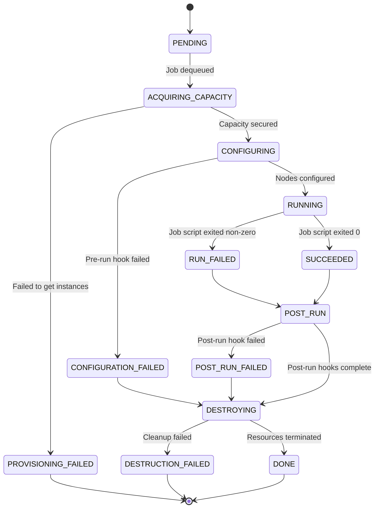

# Advanced Orchestrator: A Proposal for a Scalable, Next-Generation Cluster Management System

**Author:** Kelvin Woo  
**Date:** 2025-06-21  
**Status:** DRAFT  


## 1. Context and Purpose

Our current orchestrator, a system built around direct EC2 API calls and the Slurm workload manager, was effective in our early stages. It was designed to spin up single-instance-type, single-availability-zone clusters, configure them via SSH with bash scripts, and submit a single job. However, we are seeing a lot of new use cases that are not well supported by the current system.

This document proposes its replacement: the **Advanced Orchestrator**, a new control plane designed for horizontal scalability, configuration-driven infrastructure, and robust, observable operations. 

We are writing this now because the limitations of the current system are actively delaying research projects and not allowing us to iterate fast enough.
 

## 2. Executive Summary

The existing cluster orchestrator can no longer meet our scaling and reliability requirements. Its architecture, constrained to single Availability Zones, results in a 90% failure rate for large-scale jobs due to capacity shortages. Its reliance on brittle shell scripts for configuration and a lack of centralized logging makes it fragile to maintain and difficult to debug, increasing operational toil and Mean Time To Resolution (MTTR). To solve these problems, we recommend designing and building a new **Advanced Orchestrator**. This new system will be a cloud-native control plane that manages a global job queue, acquiring compute capacity intelligently across multiple Availability Zones, and eventually multiple regions and cloud providers. It will replace our static, database-driven cluster types with flexible, version-controlled YAML configuration files, empowering research teams to define their exact software and hardware environments. The system will be built with deep observability from the ground up, providing centralized, structured logs and metrics for every job and component. This investment will unblock our research teams by providing reliable and scalable access to compute, increase developer velocity by enabling self-service infrastructure, and reduce operational costs by automating away the manual, reactive work that currently dominates our platform engineering efforts.

## 3. Problem Statement

The core problem is that our current infrastructure for launching computational jobs is failing to scale with the business. This failure manifests in several critical ways. First, we suffer from **frequent capacity-related job failures**. Because the launcher is architecturally limited to a single AWS Availability Zone per job, it regularly fails to acquire the necessary number of EC2 instances for our largest workloads. We have measured that this impacts one in every five large-scale submissions, delaying critical research timelines.

Second, the system is **brittle and expensive to maintain**. Cluster setup is governed by a collection of legacy bash scripts that are poorly understood and tightly coupled. Any modification, whether to update a software version or add a new instance type, is a high-risk operation that consumes an estimated 40 engineering hours per quarter in debugging and rollbacks. This fragility has created a culture of fear around infrastructure changes, stifling innovation in our compute environments.

Finally, the system is **operationally opaque**. Debugging a failed job requires an engineer to manually SSH into a head node to inspect disparate log files. There is no centralized view of system health, job status, or resource utilization. This lack of observability means that when things go wrong, it takes far too long to understand why, directly impacting our Mean Time To Resolution for any production incident. The combination of these issues creates a system that is simultaneously unreliable for its users and a persistent source of unplanned work for the engineering team.

## 4. Goals

The primary goal of the Advanced Orchestrator is to provide a reliable, scalable, and efficient platform for computational workloads. Success will be measured against the following outcomes:

*   **Improve Job Reliability and Scale:** The system must drastically reduce capacity-related failures by intelligently acquiring resources across multiple Availability Zones, and later, across regions.
*   **Increase Developer Velocity:** Empower research teams to define and iterate on their own compute environments using declarative configuration files, removing the platform team as a bottleneck.
*   **Enhance Operational Excellence:** Provide deep observability into the entire system, from the API layer down to individual jobs, through centralized and structured logging, metrics, and tracing.
*   **Establish a Foundation for the Future:** The architecture must be modular and extensible, allowing for the future integration of new cloud providers (e.g., GCP, Azure) and new compute runtimes (e.g., Kubernetes) with minimal changes to the core system.

## 5. Detailed Analysis & Options

To address the problems, we considered three distinct options.

**Option 1: Incrementally Improve the Existing System.**
This option involves dedicating engineering resources to patching the deficiencies of the current orchestrator. We could add logic to cycle through AZs on failure, refactor the most problematic bash scripts into a more robust language, and retrofit a logging agent onto the cluster nodes. While this would provide some relief, it does not address the fundamental architectural flaws. The system would remain a monolithic script-runner, the logic would become even more complex and stateful, and it would not provide a path toward a global queue or multi-cloud capabilities. This approach treats the symptoms, not the disease, and would likely result in a system that is even more difficult to maintain in the long run.

**Option 2: Adopt an Off-the-Shelf (OTS) Solution.**
We could adopt a pre-built workflow orchestrator, such as a Kubernetes-native engine like Argo Workflows or a commercial High-Performance Computing (HPC) management suite. This path offers the potential for faster initial deployment. However, it comes with significant trade-offs. We would be ceding control over our core scheduling and capacity acquisition logic to a third party, making it difficult to implement our specific optimizations for cost and performance (e.g., our multi-AZ bin-packing strategy). Furthermore, we risk vendor lock-in and may find that the OTS solution's abstractions do not perfectly match our needs, forcing us into awkward workarounds, particularly for our specialized MPI-based workloads.

**Option 3: Build the Proposed Advanced Orchestrator (Recommended).**
This option involves building a new, bespoke control plane designed specifically for our needs, as detailed in this document. It represents a significant investment but is the only option that directly addresses all of our stated problems and goals. It gives us complete control over the most critical aspects of our platform: the queuing, scheduling, and capacity acquisition logic. It allows us to build a clean, modular architecture with a robust, public API that can serve as a stable foundation for years to come. While the upfront cost is higher, the long-term benefits of a flexible, scalable, and observable system that is tailored to our unique workload profile are overwhelming. Building this system is a strategic investment in our core infrastructure.

## 6. Recommendation

We strongly recommend pursuing **Option 3: Build the Advanced Orchestrator**. This system will be composed of a **Control Plane**, a **Capacity Adapter**, and an **Observability Stack**, which work in concert to reliably execute user jobs.

The process begins when a user submits a YAML manifest describing their job to the **API Gateway**. The request is authenticated and the manifest is validated by a **Configuration Service**. If valid, the job is placed into a **Global Queue**, which uses priority and fair-share logic to decide when the job should run.

When a job is dequeued, the **Lifecycle Controller** takes over. This state machine is the heart of the orchestrator, managing the job from start to finish. Its first step is to pass the resource request to the **Capacity Adapter**. This adapter is a crucial abstraction layer that translates a generic request for "64 P4d instances" into specific API calls for a cloud provider. The initial implementation will target AWS, where the adapter will perform a multi-AZ "bin-packing" analysis to acquire the instances with the best availability and cost, leveraging Spot instances where possible.

Once capacity is provisioned, the Lifecycle Controller executes a series of configurable **Lifecycle Hooks** defined in the user's manifest. These hooks handle tasks like installing software, downloading data, running the primary analysis, and uploading results. Throughout this entire process, all components—from the API to the individual job scripts—are constantly emitting structured logs and metrics to an **OpenTelemetry pipeline**, which feeds into CloudWatch for centralized monitoring, dashboarding, and alerting. This ensures that we have complete visibility into the system's behavior and performance at all times.

The rollout will be managed in four phases to mitigate risk: a non-disruptive **Shadow Mode** to validate the new logic on production traffic, a limited **Internal Dogfooding** phase, a gradual **Phased Rollout** to the general user base using feature flags, and finally, the **Deprecation** of the legacy system. This methodical approach, combined with a robust design, will provide a stable, scalable, and observable foundation for all future computational research at the company.

## 7. Appendices

### 7.1. Target Architecture Diagram
```mermaid
graph TD
    subgraph User Interaction
        Client[CLI / SDK / UI]
    end

    subgraph "Control Plane (Orchestrator Service)"
        API[API Gateway <br> (REST/GraphQL, AuthN/AuthZ)]
        Queue[Queue Manager <br> (Global Priority Queue, Fair Share)]
        Lifecycle[Lifecycle Controller <br> (State Machine, Event-Driven)]
        ConfigSvc[Configuration Service <br> (Manifest Validation & Storage)]
    end

    subgraph "Capacity & Execution Layer"
        Adapter[Capacity Adapter]
        subgraph "Cloud Providers"
            AWS[AWS Adapter <br> (EC2, EKS, Spot Advisor)]
            FutureCloud["(Future) <br> Azure/GCP Adapter"]
        end
        subgraph "Execution Runtimes"
            Slurm[Slurm Clusters (Multi-AZ)]
            EKS[EKS Clusters (Multi-AZ)]
        end
    end

    subgraph "Observability Stack"
        Collector[OpenTelemetry Collector]
        Logs[CloudWatch Logs]
        Metrics[CloudWatch Metrics]
        Dashboards[Dashboards & Alerting <br> (Grafana / CloudWatch)]
    end

    Client --> API
    API --> Queue
    API --> ConfigSvc
    Queue --> Lifecycle
    Lifecycle --> Adapter
    Lifecycle -- Manages --> Slurm
    Lifecycle -- Manages --> EKS
    ConfigSvc --> Lifecycle

    Adapter --> AWS
    Adapter --> FutureCloud
    AWS -- Provisions --> Slurm
    AWS -- Provisions --> EKS

    Slurm -- Logs & Metrics --> Collector
    EKS -- Logs & Metrics --> Collector
    Lifecycle -- Events --> Collector
    Queue -- Metrics --> Collector
    Collector --> Logs
    Collector --> Metrics
    Logs --> Dashboards
    Metrics --> Dashboards
```

### 7.2. Lifecycle State Machine Diagram


### 7.3. Sample YAML Manifest
```yaml
apiVersion: orchestrator.our-company.com/v1alpha1
kind: ClusterDefinition
metadata:
  name: "protein-folding-gpu-cluster"
  namespace: "research-and-development"
  labels:
    project: "bio-research"
    cost-center: "rd-123"
spec:
  # Define pools of nodes with different characteristics
  nodePools:
    - name: "head-node"
      count: 1
      instanceType: "m6i.xlarge"
      purchaseOption: "OnDemand"
    - name: "gpu-workers"
      count: 64
      # List multiple instance types for flexibility
      instanceType:
        - "p4d.24xlarge"
        - "p3.16xlarge"
      purchaseOption: "SpotPreferred" # Use Spot but fall back to OnDemand
      diskSizeGiB: 512
  
  # Define placement and networking constraints
  placement:
    region: "us-east-1"
    availabilityZones: # Can be a list or "any"
      - "us-east-1a"
      - "us-east-1b"
      - "us-east-1d"

  # Define lifecycle hooks for custom setup
  hooks:
    # Runs on all nodes after provisioning but before job submission
    onConfigure:
      - name: "Install NVIDIA Drivers"
        script: |
          #!/bin/bash
          set -ex
          # nvidia-driver-installer.sh
    # Runs on the head node after the main job completes
    onPostRun:
      - name: "Upload results to S3"
        image: "aws-cli:latest"
        command: ["aws", "s3", "sync", "/data/results", "s3://my-research-bucket/results"]

  # Define runtime-specific configuration
  runtime:
    type: "Slurm"
    version: "23.02"

  # Define job timeout
  ttlSeconds: 86400 # 24 hours
```

### 7.4. Glossary of Acronyms

*   **API:** Application Programming Interface
*   **AZ:** Availability Zone
*   **EKS:** Elastic Kubernetes Service (AWS)
*   **JWT:** JSON Web Token
*   **MPI:** Message Passing Interface
*   **MTTR:** Mean Time To Resolution
*   **ODCR:** On-Demand Capacity Reservation (AWS)
*   **OIDC:** OpenID Connect
*   **OTS:** Off-The-Shelf
*   **SDK:** Software Development Kit
*   **SLA:** Service-Level Agreement
*   **TTL:** Time To Live
