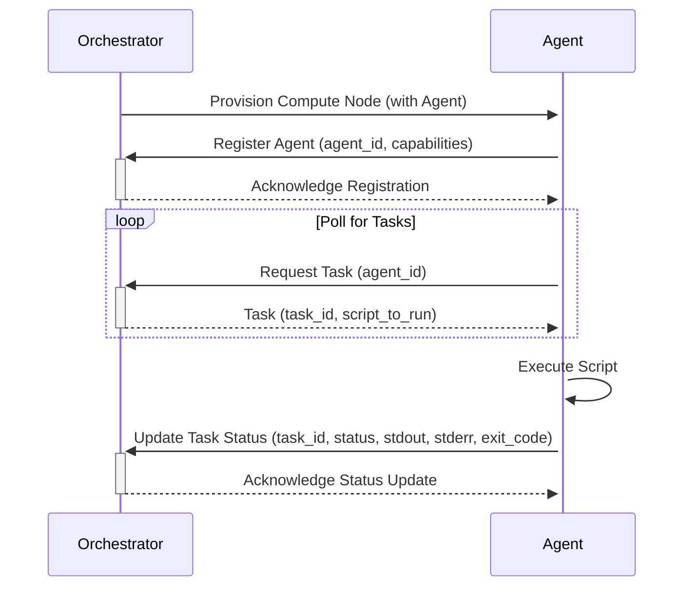

# Orchestrator Agent: A Proposal for Robust Compute Node Management

**Author:** Kelvin Woo
**Date:** 

## 1. Context and Purpose

The scala-go orchestrator is responsible for provisioning AWS EC2 instances that serve as compute and head nodes for distributed simulations. A critical part of this process involves configuring these nodes after they boot, which includes setting up software, running initialization scripts, and launching simulation tasks.

Currently, the orchestrator interacts with these nodes by executing commands and scripts over direct SSH connections. While functional for basic scenarios, this mechanism is proving to be a bottleneck and a source of fragility as our system scales and our task-running requirements become more complex.

This document proposes a fundamental shift in our approach: moving from a push-based SSH model to a pull-based agent model. We will design and build a lightweight agent that runs on each provisioned node. This agent will communicate with the orchestrator over a secure, reliable API to request tasks and report results. This document outlines the problem with the current approach, analyzes alternatives, and presents a detailed recommendation for the agent-based architecture.

## 2. Executive Summary

The current method of managing compute nodes via SSH is brittle, lacks detailed observability, and presents scalability challenges. When a script fails, it is difficult to differentiate between network failures, script errors, or infrastructure issues without manual intervention and log analysis. This leads to longer recovery times and operational overhead.

We propose developing and deploying a dedicated orchestrator agent on each compute node. This agent will replace all SSH-based command execution with a robust, API-driven communication flow. Upon startup, the agent will register itself with the orchestrator and begin polling for tasks. For each task, the agent will execute the required script, capture its complete output (stdout, stderr) and exit code, and report this structured result back to the orchestrator.

This agent-based model offers significant advantages:
*   **Reliability:** It provides a clear, stateful communication protocol, allowing for retries and explicit error handling.
*   **Observability:** The orchestrator will receive detailed, structured results for every task, enabling faster, automated diagnosis of failures.
*   **Scalability:** A pull-based architecture where thousands of agents can poll an API endpoint is significantly more scalable than the orchestrator managing thousands of concurrent SSH connections.
*   **Security:** It improves our security posture by removing the need for inbound SSH access from the orchestrator to the compute nodes. Nodes only need to make outbound HTTPS requests.

We have analyzed alternatives, including maintaining the status quo and adopting a third-party configuration management tool, but the custom agent model provides the best fit for our specific, dynamic task-execution needs. We recommend proceeding with the design and implementation of this agent and the corresponding orchestrator API.

## 3. Problem Statement

Our reliance on SSH for remote command execution presents several critical problems that inhibit our ability to build a resilient and scalable orchestration platform.

1.  **Lack of Structured Error Reporting:** The primary issue is the ambiguity of failures. An SSH command returns a single exit code, which is insufficient for programmatic decision-making. We cannot easily distinguish between a failure in the SSH connection itself, a network partition, a permission issue on the remote host, or a bug within the executed script. The orchestrator has no visibility into the `stdout` or `stderr` of the script without complex, fragile log scraping logic.

2.  **Poor Visibility and Debugging:** When a simulation fails during the setup phase, operators must manually SSH into the machines to inspect logs and determine the root cause. This reactive, manual process is slow, inefficient, and does not scale with the number of simulations we run.

3.  **Scalability Bottlenecks:** The current "push" model requires the orchestrator to initiate and maintain a separate SSH connection for every node it manages. As we scale to larger clusters with hundreds or thousands of nodes, managing this connection pool becomes a significant resource bottleneck for the orchestrator, limiting platform throughput.

4.  **Inflexible Security Model:** The model requires that every compute node has an open SSH port (22) and that the orchestrator's security group is authorized to connect to it. This increases the attack surface of our compute infrastructure. Managing SSH keys and ensuring their secure rotation is an additional operational burden.

## 4. Goals

Our primary goal is to create a more robust, observable, and scalable system for managing tasks on compute nodes. The success of this proposal will be measured against the following objectives:

*   **Replace SSH-based execution:** To completely eliminate the orchestrator's reliance on SSH for running scripts on compute nodes.
*   **Establish Standardized Communication:** To define a clear, versioned, and secure API that governs all interactions between the orchestrator and the agents.
*   **Enable Rich Task Reporting:** To provide the orchestrator with detailed, structured results for every task, including its final status (`completed`, `failed`), exit code, and the complete `stdout` and `stderr` streams.
*   **Improve Security Posture:** To reduce the attack surface of our compute fleet by removing the requirement for inbound SSH access on nodes.

## 5. Detailed Analysis and Options

We considered three primary options to address the problems outlined above.

### Option 1: Maintain the Status Quo (SSH-based Execution)

This option involves making no changes and continuing to use SSH for command execution.

*   **Pros:** Requires no immediate development effort or infrastructure changes.
*   **Cons:** This approach does not solve any of the stated problems. The system will remain brittle and hard to debug. As we scale, the operational cost and frequency of failures will increase, making this option untenable in the long run. It represents a significant and growing technical debt.

### Option 2: Use a Configuration Management Tool (e.g., Ansible)

This option involves integrating a mature configuration management tool like Ansible into the orchestrator to manage compute nodes.

*   **Pros:** Tools like Ansible are industry-standard and provide robust, idempotent, and declarative ways to manage system state. They offer better error handling and reporting than raw SSH.
*   **Cons:** Integrating a new, heavy third-party tool introduces significant complexity and a steep learning curve to our stack. These tools are primarily designed for configuration management (ensuring a system is in a desired state) rather than the dynamic, one-off task execution that constitutes much of our workload. The communication model is still primarily push-based, which does not fully resolve the scalability concerns at a very large scale. It would be a powerful but potentially oversized and ill-fitting tool for our specific problem.

### Option 3: Custom Agent-based Model (Recommended)

This option involves building a lightweight, custom agent that is installed on each compute node and communicates with the orchestrator over a REST API.

*   **Pros:**
    *   **Tailor-Made Solution:** The agent can be designed to do precisely what we need—run scripts and report detailed results—without the overhead of a generic tool.
    *   **Scalability:** A pull-based model, where agents poll an orchestrator endpoint for tasks, is highly scalable and removes the connection management bottleneck from the orchestrator.
    *   **Control & Visibility:** A custom API gives us full control over the data exchanged. We can create a rich data model for tasks and results, providing excellent visibility into the state of every node.
    *   **Enhanced Security:** The agent only initiates outbound HTTPS connections to the orchestrator. This eliminates the need for any inbound ports (like SSH) to be open on the compute nodes, drastically reducing the attack surface.
*   **Cons:** This option requires an upfront investment in development effort to build and test the agent and the orchestrator's API endpoints. It also introduces new components that must be maintained.

## 6. Recommendation

We strongly recommend **Option 3: Custom Agent-based Model**.

While it requires an initial development effort, this model directly solves all the core problems of our current SSH-based system. It provides a purpose-built, highly scalable, and secure foundation for managing our compute resources. The long-term benefits in reliability, observability, and operational efficiency far outweigh the upfront implementation cost. This investment will pay dividends as our platform scales and will enable us to build more complex and resilient features in the future.

### Next Steps

1.  **API Development:** Finalize and implement the orchestrator-side REST API endpoints for agent registration and tasking.
2.  **Agent Development:** Develop the agent in Go, including logic for registration, task polling, script execution, and result reporting.
3.  **AMI Integration:** Package the agent into the base compute node AMI.
4.  **Orchestrator Logic Update:** Modify the orchestrator's workflow to dispatch tasks through the new API and process the results reported by agents.
5.  **Testing:** Conduct end-to-end testing with a pilot simulation to validate the new architecture.

## 7. Appendices

### Appendix A: Proposed API Specification

Communication between the agent and the orchestrator will be done via a RESTful API with JSON payloads.

*   **`POST /api/v1/agents/register`**: Used by the agent to register itself upon startup.
    *   **Request Body:** `{"agent_id": "...", "instance_id": "...", "capabilities": ["shell", "python"]}`
    *   **Response:** `200 OK`

*   **`GET /api/v1/tasks?agent_id=<agent_id>`**: Used by the agent to poll for new tasks.
    *   **Response Body (Task available):** `{"task_id": "...", "script": "echo 'Hello'"}`
    *   **Response Body (No task):** `204 No Content`

*   **`POST /api/v1/tasks/<task_id>/status`**: Used by the agent to report the status and result of a task.
    *   **Request Body:** `{"status": "completed", "stdout": "...", "stderr": "...", "exit_code": 0}`
    *   **Response:** `200 OK`

### Appendix B: Architectural Diagram

