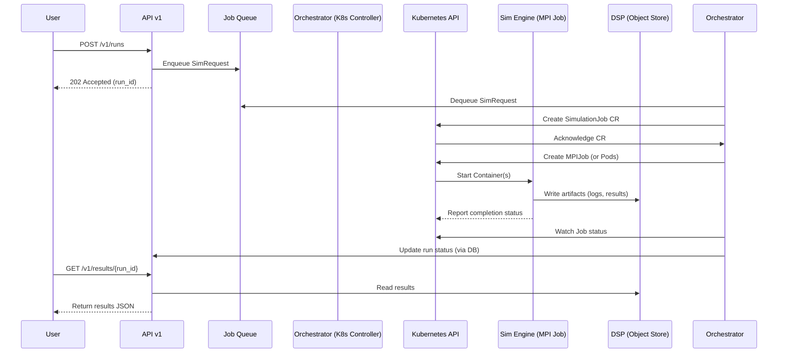

# Summary of Orchestrator & DSP Requirements

Based on the PRD document, here is a summary of the requirements for the "Orchestrator" and "DSP" (Data Store).

### Orchestrator Requirements

The Orchestrator is the service responsible for scheduling and managing simulation engine containers for each run.

*   **Core Functionality:**
    *   Receives job creation requests from the API.
    *   Launches simulation engine (MPI) instances with a specific `run_id` and `seed`.
    *   Manages the lifecycle of the simulation job and reports status back to the API.
    *   Enqueues jobs and supports streaming partial artifacts.

*   **Performance & Latency (SLOs):**
    *   The total orchestration time for a 144-GPU simulation is budgeted at **≤ 15 minutes**.
    *   The time from a run being accepted to the simulation engine launching must be **P95 ≤ 5 minutes**.

*   **Scalability & Reliability:**
    *   Must handle **≥ 5 parallel 144-GPU runs** without breaching SLOs.
    *   Needs to scale to handle load, potentially via autoscaling workers.
    *   Requires mechanisms to manage saturation, such as per-tenant concurrency caps, queuing, and graceful degradation (returning `429` errors with `Retry-After` headers).

*   **Operability:**
    *   Requires dashboards to monitor key metrics like P95 latency and error rates.
    *   Must have runbooks for handling failures.

### DSP (Data Store) Requirements

The DSP is the storage system for all artifacts and results generated by the simulation runs.

*   **Core Functionality:**
    *   Stores immutable, versioned, and content-addressed artifacts from each run, including configurations, seeds, logs, and results.
    *   The simulation engine writes artifacts directly to the DSP.
    *   The API reads results from the DSP to serve user requests.

*   **Performance & Latency (SLOs):**
    *   Ingestion of simulation results must complete with a **P95 latency of ≤ 60 seconds**.

*   **Reliability & Data Integrity:**
    *   Storage must be durable.
    *   It has a Recovery Point Objective (RPO) of **≤ 24 hours** and a Recovery Time Objective (RTO) of **≤ 4 hours**.
    *   Default data retention is **30 days**.

---

# 1-Pager: Simulation Orchestrator & Data Store Tech Spec

#### **1. Objective**

To design and build a scalable, reliable, and performant orchestration service and data store for the Scale-Up Simulation platform. This system will manage the lifecycle of simulation runs and handle the storage and retrieval of their artifacts, meeting the M1 performance and reliability targets outlined in the PRD.

#### **2. High-Level Architecture**

The proposed architecture uses a Kubernetes-native approach for orchestration and a cloud object store for data persistence.

#### **3. Component Design**

**A. Orchestrator**

*   **Technology:** A Kubernetes Operator (Custom Controller) written in Go or Python. This pattern provides robust, declarative management of simulation jobs.
*   **Workflow:**
    1.  **Job Ingestion:** The Platform API receives a run request and places it into a durable message queue (e.g., RabbitMQ, AWS SQS) to decouple the API from the orchestration logic and handle backpressure.
    2.  **Job Management:** The Orchestrator controller dequeues messages and creates a `SimulationJob` Custom Resource (CR) in Kubernetes.
    3.  **Execution:** The controller translates the CR into a Kubernetes `Job` (specifically, an `MPIJob` using a framework like Kubeflow) that runs the containerized simulation engine. It injects the `run_id`, `seed`, and configuration.
    4.  **Status Tracking:** The controller monitors the `MPIJob`'s status (`running`, `succeeded`, `failed`) and updates the central application database, making the status available via the API.
*   **Meeting Requirements:**
    *   **Scalability (`≥ 5 parallel runs`):** Kubernetes can easily scale worker nodes. The queue and per-tenant logic in the controller will manage concurrency limits, returning `429` if necessary.
    *   **Performance (`P95 ≤ 5 min` launch):** A queue-based, event-driven design is highly efficient. The primary latency will be container image pull times and pod scheduling, which can be optimized with pre-pulled images and cluster autoscaling.
    *   **Reliability:** The K8s controller pattern provides self-healing and reconciliation loops. The message queue ensures job requests are not lost if the orchestrator restarts.

**B. DSP (Data Store)**

*   **Technology:** A cloud-based object store (e.g., **Amazon S3**, GCS, or a self-hosted MinIO).
*   **Schema & Workflow:**
    1.  **Structure:** Artifacts will be stored using a content-addressed scheme to ensure immutability and simplify versioning. The object key could be `artifacts/{run_id}/{hash_of_content}`.
    2.  **Access Control:** The Orchestrator will generate and inject short-lived, scoped credentials (e.g., via IAM roles for service accounts) into the simulation engine pods, granting them write-only access to a specific path in the storage bucket. The API will have read-only access.
    3.  **Data Lifecycle:** A 30-day retention policy will be implemented using the object store's native lifecycle management rules to automatically delete old artifacts, controlling costs.
*   **Meeting Requirements:**
    *   **Durability & RPO/RTO:** Cloud object stores provide extremely high durability (e.g., 99.999999999%) and are managed services, aligning with the RPO/RTO goals.
    *   **Performance (`P95 ≤ 60s` ingest):** Direct-to-storage writes from the simulation engine are highly performant and scalable.
    *   **Immutability:** The content-addressed, write-once pattern ensures artifacts are immutable.

---

#### **4. High-Level Estimate & Work Breakdown**

*Assumes a team of 2-3 engineers familiar with Kubernetes and the chosen cloud provider.*

| Category | Task | Estimate (Person-Weeks) |
| :--- | :--- | :--- |
| **Orchestrator** | 1. Define `SimulationJob` CRD and Controller Scaffolding | 1 |
| | 2. Implement Job Queue & Dequeue Logic | 2 |
| | 3. Implement Core Controller Reconciliation Loop (CR -> MPIJob) | 3 |
| | 4. Implement Status Tracking and DB Updates | 1 |
| **DSP** | 5. Provision Object Storage (IaC - Terraform/CloudFormation) | 0.5 |
| | 6. Implement Secure Credential Injection for Pods | 1.5 |
| | 7. Implement Artifact Naming Scheme & Lifecycle Policies | 1 |
| **Integration & Ops** | 8. API changes to integrate with the Job Queue | 1 |
| | 9. Containerize Simulation Engine & CI/CD for Controller | 2 |
| | 10. Monitoring, Alerting, and Dashboards for SLOs | 2 |
| | 11. End-to-End Testing & Documentation | 2 |
| **Total** | | **~17 Person-Weeks** |

**Project Timeline Estimate:** **8-10 weeks** (with a 2-3 person team).
