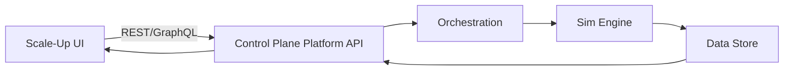
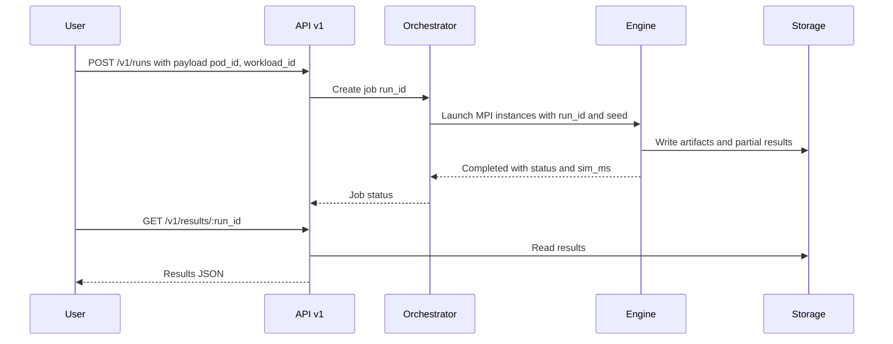

# Scale-Up_PRD_Rewritten_Complete_v2.4

# Scale-Up Simulation — Self-Contained PRD (v2)

## 0) Metadata

- Doc: Scale-Up Accelerator Fabric Simulation — Production PRD (Self-Contained)
- Version: 2.4
- Date: 2025-09-22
- Owner: PM
- Reviewers: Eng Lead, SRE, UX, Data, Security, Legal
- Status: Review
- Change Control: §26
- Supersedes: `Scale-Up_PRD_Rewritten_Complete.md` (v1.x). This v2 document is a fully self-contained, expanded version with detailed narrative, requirements, validation math, telemetry, rollout playbooks, and appendices.
- Requirements Mapping: See `Scale-Up_PRD_annotated.md` for one-to-one mapping from the original PRD to this document.

## 0.1) Core Principle — Single-Source of Truth

- This document is authoritative and self-contained. A reader can understand context, implement, validate, and launch the feature using only this document plus standard engineering playbooks (coding standards, QA guides, security policies).
- No external threads (email/Slack) are required. All decisions and changes are captured in §13 (Decision Log) and §26 (Change Log). Supporting research is summarized inline and linked in §33.

## 1) Executive Summary / Objective

This PRD specifies a deterministic, production-grade simulation for Scale-Up accelerator fabrics (e.g., UALink-class/NVLink-class equivalents) within a single pod up to 144 GPUs in Milestone 1 (M1). The objective is to reduce time-to-decision for pod configuration by ≥50% while achieving ≤10% deviation from hardware reference benchmarks on defined evaluation cases. Success is measured through explicit KPIs (§3) and verified via a golden test corpus.

## 2) Background & Goals

- Problem: Architectural exploration of intra-pod GPU interconnects occurs late in hardware labs, causing capital inefficiency and schedule risk. Performance is sensitive to link configuration and workload mapping; reproducibility is scarce.
- Opportunity: Provide deterministic simulations that narrow choices before lab spend, enabling faster, defensible decisions.
- Market/Competitive: Existing tools are packet-/synthetic-focused, seldom integrate with customer training traces, lack determinism, and don’t expose Scale-Up constructs. Our differentiation: pod-first UX, deterministic replay, workload-driven metrics.
- Goals (measurable):
    - G1: Deterministic single-pod runs up to 144 GPUs (M1) with fidelity ≤10% on defined cases
    - G2: TTRun for 500 ms @ 144 GPUs ≤ 30 minutes wall-clock (budgeted)
    - G3: Validation blocks invalid topologies pre-run with canonical error codes
- Non-Goals (M1): Multi-hop; NIC sharing; fractional NIC:GPU; virtual pods; heterogeneous pods; Scale-Out integration; optimized mapping generator; flow viewer.

## 3) Success Metrics

- North-star: Time-to-decision for pod configuration reduced by ≥ 50%.
- Primary KPIs:
    - TTRun_500ms_144GPU_total ≤ 30 min; budgets: orchestration ≤ 15, preprocessing ≤ 2, simulation ≤ 6, remainder ≤ 7.
    - Determinism: identical outputs for same seed/input across runs.
    - Fidelity: ≤ 10% error vs lab benchmarks on defined cases.
- Guardrails:
    - Orchestration cost per run ≤ X (Assumption → Verify).
    - DSP ingestion P95 ≤ 60 s.
- Instrumentation Plan (events): `simulation_started`, `simulation_completed`, `validation_failed`, `results_published` with properties: `run_id`, `seed`, `pod_id`, `gpu_total`, `wall_ms`, `sim_ms`, `success`, etc.

## 4) Scope & Out-of-Scope

- In-Scope (M1): Single pod; one-hop multi-rail; idealized switch; Data Movement Push/Pull; HBM BW/latency; LinkPattern (lanes {1,2,4}, lane_rate {100,200,400}, delay_ns [1,100]); UX flow; APIs; telemetry; rollout flags.
- Out-of-Scope (M1): Scale-Out; NIC:GPU ≠ 1:1; mapping optimizer; flow viewer; virtual pods; multi-job per pod; vendor-proprietary models.
- Feature Map:
    - Single Pod Simulation → Validates pod design → KPI TTRun.
    - Deterministic Runs → Repeatability → KPI Determinism.
    - Validations → Prevent invalid configs → KPI Validation coverage.
- Clarifications:
    - Transport semantics: M1 models Scale-Up transfers as load/store memory-line operations (Push/Pull). Streaming/verbs-style transports (e.g., RDMA write/read) are associated with Scale-Out and are deferred to M2.
    - Interfaces: M1 assumes direct GPU-to-switch fabric interfaces and bypasses PCIe; explicit NIC and IO-bus modeling is deferred to M2 when Scale-Out integration is introduced.
    - Switch behavior: M1 uses an idealized switch with serialization, propagation, and lumped forwarding delay; buffered queueing/forwarding behavior and per-queue metrics are deferred to M2.

## 5) User Stories / Use Cases

- US-001 Validate a Scale-Up topology before use
    
    ```gherkin
    Given a proposed pod with gpu_total in [8, 144]
    And a switch model with lanes ∈ {1,2,4} and lane_rate ∈ {100,200,400}
    When I click Validate
    Then I see either valid=true or errors with codes and remediation
    And validation completes in P95 ≤ 10s
    ```
    
- US-002 Deterministically replay a run
    
    ```gherkin
    Given a validated pod and workload with seed S
    When I run twice with seed S
    Then engine outputs are byte-identical
    And the run metadata includes the seed used
    ```
    
- US-003 Compare two configurations
    
    ```gherkin
    Given two completed runs with the same workload and seed
    When I view Comparison
    Then I see percent deltas and confidence intervals
    And the UI calls out if inputs mismatch
    ```
    
- US-004 Programmatic control via API
    
    ```gherkin
    Given tenant API keys
    When I POST to /v1/scaleup/pods and /v1/runs with idempotency
    Then I receive ids; 409 on duplicate keys; results available ≤2 min post completion
    ```
    

## 6) Functional Requirements (FR)

- FR-1 Topology Entities (P0)
    - Provide entities — ScaleUpNode, ScaleUpSwitch, LinkPattern, Pod — to define a pod.
    - Acceptance: Create pod with `m` nodes × `n` GPUs; `r` switches; lanes {1,2,4}; lane_rate {100,200,400}; cache_line=256B.
- FR-2 Data Movement Mode (P0)
    - Select `Push (stores)` or `Pull (loads)` at simulation level; record `{mode}` in metadata.
- FR-3 Memory Model (P0)
    - Direct HBM access per GPU; configurable bandwidth up to 512 GB/s; read_latency [0.5, 2.0] µs.
- FR-4 Determinism (P0)
    - Seed recorded; repeat run with same seed yields byte-identical engine results.
- FR-5 Validation (P0)
    - Block invalid configs with error codes/messages; equations §6.1.
- FR-6 UX Flow (P0)
    - Scale-Up tab supports model selection, link modal, import, validations, run, results.
- FR-7 Results & Comparison (P1)
    - Completion-time distribution, tokens/sec (if available), percent deltas.
- FR-8 APIs (P1)
    - OpenAPI published; CRUD for pods/models/links; run creation; results fetch; idempotent write ops; versioned v1.
- FR-9 Transport Semantics (P0)
    - Represent Scale-Up transfers using load/store semantics over memory lines; explicitly bypass PCIe and model direct HBM access. Document that streaming/verbs transports are out-of-scope for M1 and slated for M2 with Scale-Out.

### 6.1 Validation Equations (enforced)

- `gpu_total = m × n`
- `r ≤ gpu_ports` (A2A; one port per switch)
- `switch_radix ≥ gpu_total` (per switch; after lane aggregation rules)
- `parallel_lanes ∈ {1,2,4}`
- `lane_rate ∈ {100,200,400} (Gbps)`
- `delay_ns ∈ [1, 100]`
- Push: sync barrier at end of stores; Pull: idealized infinite buffer (assumption)
- Error codes: `VAL_RADIX_EXCEEDED`, `VAL_PORTS_INSUFFICIENT`, `VAL_PARAM_RANGE`, `VAL_MAPPING_REQUIRED`

## 7) Non-Functional Requirements (NFR)

- NFR-1 Availability: Simulation service 99.5% monthly (Assumption → Verify)
- NFR-2 Latency/Capacity:
    - Orchestration start→sim-launch P95 ≤ 5 min (within ≤15 min budget)
    - Results publish P95 ≤ 2 min after sim completion
    - Concurrency: ≥ 5 parallel 144-GPU runs without SLO breach (Assumption → Verify)
- NFR-3 Scalability: Supported/tested to 144 GPUs M1; design not hard-limited; determinism maintained
- NFR-4 Security/Privacy: Per-tenant isolation; audit events; retention 30 days (Assumption → Verify)
- NFR-5 Compliance/A11y: Track SOC2 controls; UI meets WCAG 2.1 AA
- NFR-6 Reliability/DR: DSP storage durable; RPO ≤ 24h; RTO ≤ 4h (Assumption → Verify)
- NFR-7 Operability: Metrics/alerts for SLOs; runbooks for validation/orchestration/engine failures

## 8) System & Data Flows

- Architecture and sequence as in §14.
- API contracts in §21.

## 9) Dependencies & Assumptions

- ns-3 engine ≥ 4.0 with Scale-Up models
- Chakra GPU endpoints v2.0
- Orchestration platform
- Assumptions tracked to closure in §13

## 10) Release Criteria / KPIs

- Entry to Beta: FR-1..FR-6 complete; NFR latency budgets green in staging; dashboards/runbooks published; OpenAPI v1 public
- Exit to GA: KPIs in §3 meet targets for 2 consecutive weeks; eval benchmarks pass; error budgets respected; incident-free 1 week

## 11) Risks & Mitigations

- Idealized switch fidelity → Compare vs lab; document deltas; buffered model M2
- Orchestration scaling → Load test; cap concurrency; queue; observe SLOs
- NVLink proprietary gaps → Use generic models; vendor models later

## 12) Traceability Matrix

- G1 Deterministic runs → FR-1/FR-2/FR-4/FR-5 → Metrics Determinism pass rate, TTRun
- G2 Fidelity ≤10% → FR-3/FR-5 → Metrics `fidelity_error_pct`
- G3 TTRun reduction → FR-6/FR-7/FR-8 → Metrics TTRun, dashboard adoption
- NFR conformance → NFR-1..NFR-7 → SLOs and audit evidence

## 13) Open Questions & Decision Log

- Open Questions:
    - Who sets per-run cost budget X? — PM — Due 2025-09-29
    - Final availability target? — Eng/SRE — Due 2025-10-03
    - Retention period? — Sec/PM — Due 2025-10-03
- Decisions:
    - M1 excludes NIC sharing and multi-hop; push/pull selectable — 2025-09-22

## 14) System Architecture & Data Flows

### 14.1 High-level architecture



### 14.2 Simulation sequence



### 14.3 Data retention and lineage

Artifacts (configs, seeds, results) are immutable and versioned per run; 30-day default retention (A→V) (§7, §21).

## 15) Telemetry, Analytics, & Experiments

- Events and dashboards described in this section; payload examples in §28.

### 15.1 Analytics & Visualization (definitions and displays)

- Metric definitions (M1):
    - Completion time distribution (p50, p95, tails) per run; normalized comparison across runs.
    - Tokens/sec time series when workload metadata provides tokens; aggregated and per-pod summaries.
    - Engine timing breakdown (orchestration, preprocessing, engine, publish) for TTRun budget attribution.
- Displays (M1):
    - Results page includes distribution chart, tokens/sec chart (when available), and a summary table with percent deltas vs baseline.
    - Validation results panel lists `VAL_*` codes with remediation.
- Extensibility (M2):
    - Flow viewer (pod-level communication visualization) and Scale-Up score/heatmap.
    - Custom dashboard panels for per-link/rail utilization and queueing metrics once buffered switch model is introduced.

## 16) Accessibility

- WCAG 2.1 AA; testing via Axe + manual checks

## 17) Security, Privacy, Compliance

- TLS1.3 transit; AES-256-GCM at rest; RBAC minimal; audit

## 18) Measurement Methodology — How KPIs Are Measured

- Timing points, determinism corpus, fidelity calculation, validation coverage

## 19) Edge Cases & Error Handling

- Covers invalid lane combinations, radix checks, ports per GPU limits, mapping mismatch, push vs pull semantics, and idempotency conflicts

## 20) Release Plan & Operations Playbooks

- Flags, rollout phases, operational runbooks, quotas and rate limits, rollback, and on-call expectations

## 21) API Contracts & Error Model (v1)

- Base, idempotency, pagination, response envelope and errors; endpoints; examples below

## 22) Lifecycle & Governance

- Living document: Update after any material requirement/design change; reflect decisions in §13 and bump version in §0 Metadata and §26 Change Log.
- Cross-functional sign-off required (PM, Eng, SRE, UX, Data, Security, Legal) recorded in §0 and §27.
- Link tickets/epics for execution; keep essential design decisions and rationale inside this PRD. Do not rely on ephemeral threads as authoritative sources.

## 23) Glossary

- Scale-Up: Intra-pod accelerator interconnect fabric enabling very high bandwidth and low latency between GPUs within a single pod.
- Pod: A bounded set of nodes, switches, and links forming a single-hop fabric in M1.
- Node: A compute unit hosting one or more GPUs; connects to the fabric via GPU ports.
- GPU: Graphics Processing Unit; accelerator participating in the Scale-Up fabric.
- GPU port: Physical logical port on a GPU used to connect to a switch; one port per switch in A2A.
- Lane: Physical link sub-channel; multiple lanes can be aggregated per port.
- Lane rate: Per-lane transfer rate in Gbps (100, 200, 400 supported in M1).
- Parallel lanes: Number of lanes bonded in parallel on a port (allowed: 1, 2, 4 in M1).
- Lane aggregation: Treating multiple parallel lanes as a single wider link when evaluating radix/port usage.
- Switch: Fabric element interconnecting GPU ports; see ScaleUpSwitch model.
- Switch radix: Number of external ports on a switch after lane aggregation rules are applied.
- Forwarding delay: Per-switch internal forwarding/lookup delay in nanoseconds.
- Serialization delay: Time to put a unit of data on the wire given link width and rate.
- HBM: High Bandwidth Memory directly attached to each GPU.
- Read latency: Time for a read to be satisfied from HBM; configurable in microseconds.
- LinkPattern: Logical link configuration (type, lanes, lane_rate_gbps, delay_ns) used to instantiate connections.
- ScaleUpNode: Node model with fields id, name, gpu_count, gpu_ports, cache_line_B, hbm_bw_gbps, read_latency_us, speed_factor.
- ScaleUpSwitch: Switch model with fields id, name, radix, per_port_lanes, lane_rate_gbps, fwd_delay_ns, serialization_ns.
- Determinism: Reproducible, byte-identical outputs for identical inputs and seed values.
- Seed: Integer used to initialize pseudo-random components; recorded in run metadata for replay.
- Mapping: Strategy used to assign workload entities to GPUs (e.g., linear or custom).
- Linear mapping: Default mapping where workload elements are assigned to GPUs in order.
- Custom mapping: User-provided assignment of workload elements to GPUs.
- TTRun: Total wall-clock time from run acceptance to results availability for a predefined simulation (e.g., 500 ms sim time at 144 GPUs).
- Tokens/sec: Throughput metric exposed when workload metadata supports tokenized output.
- Distribution (p50/p95): Statistical summary of completion times or throughput; p50 is median, p95 is 95th percentile.
- Orchestrator: Service that schedules and manages engine containers per run.
- Engine: Simulation engine (ns-3 with Scale-Up models) that executes the fabric model.
- API v1: Versioned public API surface for CRUD of pods/models/links, run creation, and results retrieval.
- Idempotency key: Client-supplied key ensuring that duplicate write requests return the original response instead of creating new resources.
- Artifact: Immutable object produced by a run (configs, logs, traces, results) stored with content addressing.
- Run: A specific simulation execution with inputs (pod, workload, seed, mapping) and outputs (artifacts, results).
- Workload: Reference to curated traces or profiles used to drive the simulation.
- DSP / Data Store: Storage system for artifacts and published results.
- PCIe bypass: Architectural assumption for M1 that Scale-Up transactions access HBM directly without traversing PCIe; explicit PCIe bus modeling deferred to M2 when Scale-Out is added.
- A2A (All-to-All): Connectivity assumption where each GPU can reach all others via the switch fabric in one hop.
- P95: 95th percentile of a distribution; commonly used for latency/SLO targets.
- SLO / SLA: Service Level Objective/Agreement; quantitative performance/reliability targets.
- RPO / RTO: Recovery Point Objective / Recovery Time Objective for disaster recovery.
- RBAC: Role-Based Access Control.
- SOC2: Compliance framework for security, availability, processing integrity, confidentiality, and privacy.
- WCAG 2.1 AA: Web Content Accessibility Guidelines level AA conformance.
- Golden corpus: Fixed set of configurations, workloads, and seeds used to verify determinism and detect regressions.
- Content-addressed storage: Storage where objects are addressed by a hash of their content.
- Concurrency limit: Maximum number of runs processed simultaneously for a tenant.
- Rate limiting: Mechanism that bounds request frequency; exceeding limits yields 429 responses.
- Conflict (409): Error when an operation conflicts with the current state (e.g., idempotency key reuse with different payload).
- Deterministic replay: Running the same configuration with the same seed to produce byte-identical outputs.
- SDK impacts: Changes to developer-facing model schemas (ScaleUpNode, ScaleUpSwitch, LinkPattern), example configs, and CI examples that enable programmatic creation and validation; documented in developer docs with versioned examples (P1 in M1).

## 24) Quick Checklist — Self-Contained PRD / Functional Spec

- Explains why the feature exists and the business/user impact
- Captures all what/how details (functional + non-functional)
- Provides visuals and flows that match the written spec
- Identifies dependencies, risks, and KPIs
- Includes a change log and is version-controlled

## 25) Appendix A — Wireframes & Screenshots (Authoritative references)

- Files (this repo):
    - New Pod creation:
        
        
        
    - Import Scale-Up configuration:
        
        
        
    - Import confirmation/warning:
        
        
        
    - Topology entities (nodes, pods, domains):
        
        
        
    - Topology entities (alt):
        
        
        
    - Scale-Up diagram (v1):
        
        
        
    - Scale-Up diagram (alt):
        
        
        
    - Optimized rail concept (deferred to M2):
        
        
        
    - Optimized rail (Juniper lab concept):
        
        
        
    - Rack Switch to NICs link topology:
        
        
        
    - Juniper AI Lab photo (context):
        
        
        
- Accessibility note: All dialogs and tables depicted must meet WCAG 2.1 AA (§22). Tooltips and error messages shown in screenshots are examples; authoritative copy is in §7.

## 26) Change Log (Document)

- 2025-09-22: v2.4 Reconciled requirements vs original PRD; added explicit transport/PCIe-bypass clarifications and analytics/visualization definitions; cross-referenced annotated mapping (`Scale-Up_PRD_annotated.md`).
- 2025-09-22: v2.3 Architect review added with prioritized M1/M2 TODOs; glossary expanded; Section 28 payloads detailed; Mermaid rendering and fallbacks fixed; cross-references normalized.
- 2025-09-22: v2.3a Addressed feedback from original PRD: added explicit transport semantics vs streaming note; clarified PCIe bypass; documented interface and switch model scope (idealized in M1, buffered/queueing in M2); added analytics & visualization definitions; expanded glossary (PCIe bypass, SDK impacts).
- 2025-09-22: v2.2 Align with Single-Source-of-Truth completeness standard; added SSOT section; added User Stories; converted REQ to FR and added NFR IDs; updated traceability and checklist; added Lifecycle & Governance; added References appendix; updated GA/Beta gates to FR/NFR IDs; minor cross-reference cleanups; embedded repo-local image assets.
- 2025-09-22: v2.1 Expanded v2 to be fully self-contained; embedded external wireframes; ported detailed narrative, validations, telemetry, measurement, security/privacy, accessibility, and operations from v1; added supersedence note; aligned appendices with external asset paths.
- 2025-09-22: v2.0 Self-contained PRD created from v1 with narrative detail, FR/NFR IDs, diagrams, analytics, rollout/ops, compliance, and measurement.

## 27) Document Control by Revision

- v2.2 (2025-09-22): Owner PM; Reviewers Eng Lead, SRE, UX, Data, Security, Legal. Status: Review.
- v2.1 (2025-09-22): Owner PM; Reviewers Eng Lead, SRE, UX, Data, Security, Legal. Status: Review.
- v2.0 (2025-09-22): Owner PM; Reviewers Eng Lead, SRE, UX, Data, Security, Legal. Status: Review.
- Sign-offs captured in release artifact for each milestone; any dissent or conditional approval must be summarized in §13 Decision Log.

## 28) Appendix B — Event Payload Examples (Expanded)

- simulation_started

```json
{  "event": "simulation_started",  "run_id": "uuid",  "pod_id": "uuid",  "gpu_total": 144,  "seed": 42,  "mapping": "linear",  "ts": "2025-09-22T12:34:56Z",  "meta": {"engine": "ns3-4.0", "version": "v1"}}
```

- simulation_completed

```json
{  "event": "simulation_completed",  "run_id": "uuid",  "wall_ms": 1620000,  "sim_ms": 500,  "success": true,  "engine": "ns3-4.0",  "artifacts_bytes": 1048576,  "ts": "2025-09-22T12:45:00Z"}
```

- validation_failed

```json
{  "event": "validation_failed",  "pod_id": "uuid",  "errors": [    {      "code": "VAL_RADIX_EXCEEDED",      "message": "Switch radix 64 < required 72",      "details": {"required": 72, "actual": 64}    }  ],  "duration_ms": 732,  "ts": "2025-09-22T12:31:00Z"}
```

- results_published

```json
{  "event": "results_published",  "run_id": "uuid",  "size_bytes": 1048576,  "distribution": {"p50": 123.4, "p95": 456.7},  "tokens_per_sec_p95": null,  "ts": "2025-09-22T12:46:10Z"}
```

- rate_limited (guardrail)

```json
{  "event": "rate_limited",  "tenant_id": "uuid",  "limit": 20,  "reason": "tenant_concurrency",  "retry_after_s": 60,  "ts": "2025-09-22T12:00:00Z"}
```

- conflict (idempotency)

```json
{  "event": "conflict",  "idempotency_key": "abc-123",  "resource": "/v1/runs",  "original_run_id": "uuid",  "ts": "2025-09-22T12:00:01Z"}
```

- engine_failure (operational)

```json
{  "event": "engine_failure",  "run_id": "uuid",  "stage": "simulation",  "error_code": "ENGINE_FAILURE",  "message": "Exit code 137",  "ts": "2025-09-22T12:40:00Z"}
```

- Note: Event names and top-level properties are canonical. Timestamps are ISO-8601 UTC. Additional fields may be added under `meta` without breaking compatibility.

## 29) Appendix C — References & Research Links

- Market/competitive notes: see `Scale-Up_PRD_Critique_and_Gap_Analysis.md` (external directory; summarized in §2)
- Internal critique: `SCALE_UP_PRD_CRITIQUE.md` — key recommendations incorporated in this PRD (§3, §6, §7)
- Wireframes/screenshots source directory (original): `/mnt/c/Data/Scala/docs/Scale-Up_2025-0922/`

## 30) Architect Review — Prioritized Questions & TODOs for M1/M2

### 30.1 Open Questions (blockers vs clarifications)

- P0 Blocking — Workload metadata for tokens/sec: Is tokens/sec available in all initial workloads? If not, should tokens/sec be omitted in M1 rather than partial support?
- P0 Blocking — Determinism seed scope: Confirm all sources of nondeterminism in the engine (thread scheduling, MPI collectives, RNG in workloads) are seeded and stabilized.
- P0 Blocking — Validation math lane aggregation: Confirm exact rule when lanes>1 reduce effective available switch ports; provide worked example in §6.1.
- P1 Clarification — Orchestration quotas: Finalize per-tenant concurrency caps and global queue depth for staging vs production.
- P1 Clarification — Retention period: Confirm default 30 days with Security; document extension process.

### 30.2 M1 Must-Haves (P0) — Engineering TODOs

- P0 Implement FR-1 entities and persistence for Pod/Node/Switch/LinkPattern (typed models, migrations, CRUD APIs).
- P0 Implement FR-5 validation with canonical error codes (`VAL_*`) per §6.1 and §19, including remediation messages.
- P0 Implement FR-2 data movement mode selection; record `{mode}` in run metadata; enforce Push barrier semantics in engine.
- P0 Implement FR-3 memory model parameters (HBM BW and read latency) plumbed to engine configs.
- P0 Implement FR-4 determinism pipeline: seed capture, pass-through to engine, golden replay harness for 3 configs × 3 workloads × 3 seeds.
- P0 Implement submission path: `POST /v1/runs` with idempotency; enqueue orchestration job; launch MPI instances; stream partial artifacts.
- P0 Implement results publication path: store artifacts in DSP; provide `GET /v1/results/{id}`; include distribution metrics.
- P0 Telemetry events per §28: `simulation_started`, `simulation_completed`, `validation_failed`, `results_published`; include request ids and timestamps.
- P0 Dashboards: Orchestration P95, publish P95, adoption funnel; basic error budget panel.
- P0 Feature flags: `scaleup_enabled`, `ui_scaleup_beta`; kill-switch for >2% error rate P95 over 24h.

### 30.3 M1 Should-Haves (P1)

- P1 Results comparison UI: normalized percent deltas; comparability warnings on mismatched inputs.
- P1 OpenAPI publication and examples; SDK snippets for CI automation.
- P1 Rate limiting and robust idempotency conflict handling surfaced in UI and API responses.

### 30.4 Explicit Deferrals to M2+

- M2 Multi-hop Scale-Up models; buffered switch fidelity improvements.
- M2 Mapping optimizer (heuristics/ILP) and scale-up score/heatmap analytics.
- M2 Flow viewer and advanced debugging traces.
- M2 Combined Scale-Up/Scale-Out topologies.

### 30.5 QA & Validation Plan (M1 scope)

- Golden determinism runs nightly; assert byte-identical outputs (engine results vectors and distributions).
- Validation rule coverage tests: labeled dataset of valid/invalid pods; assert correct `VAL_*` codes.
- Performance budget tests: TTRun budget attribution (orchestration ≤15m, preprocessing ≤2m, engine ≤6m, remainder ≤7m) in staging.
- A11y: Automated Axe scan and manual keyboard+SR walkthrough for Scale-Up flows.

### 30.6 Risks & Mitigations (actionable)

- Risk: Engine nondeterminism under MPI. Mitigation: pin process counts, set collective algorithms deterministically, run with fixed thread pools.
- Risk: Orchestration saturation. Mitigation: autoscale workers; enforce per-tenant caps; degrade gracefully with 429 and `Retry-After`.
- Risk: Idealized switch fidelity gap vs lab. Mitigation: document deltas; collect lab comparatives; plan buffered model in M2.

### 30.7 Milestone Exit Criteria (M1)

- FR-1..FR-6 complete; NFR-2 latency budgets met in staging.
- Determinism golden corpus passes for 2 consecutive nights.
- Telemetry and dashboards live; incident playbook documented.
- OpenAPI v1 published; example clients run end-to-end in CI.

## Appendix A: Detailed AI/LLM Node Data Flow

This appendix explains in detail the intra-node (single-node) and detailed data flows for an AI/LLM system.It focuses on microarchitecture-based data movement to facilitate accurate simulation.

## 1. Single-Node Microarchitecture

The following describes the hardware topology inside a single compute
node used for LLM training/inference:

```
                               ┌────────────────  Fabric  ────────────────┐
             (wire) ◀──────────┤ NIC0 (IB/Eth, RDMA) ────────────▶ (wire) ├────────▶ other nodes
                               └───────────────────────────────────────────┘
                                        ▲                    ▲
                                        │ PCIe (GPUDirect)   │ PCIe (GPUDirect)
                                        │                    │
        ┌────────────┐    NVLink/NVSwitch mesh     ┌────────────┐
        │   GPU0     │◀──────────────────────────▶│    GPU1     │
        │   HBM      │◀──────────────────────────▶│    HBM      │
        └────┬───────┘                             └────┬───────┘
             │ PCIe (peer/DMA)                           │ PCIe (peer/DMA)
        ┌────▼────────┐                            ┌─────▼───────┐
        │ PCIe Sw0    │◀─────────────── NVLink ───▶│  PCIe Sw1   │
        └────┬────────┘                            └────┬────────┘
   doorbells │                                  doorbells│
   + CQs     │ PCIe                                  PCIe│
             ▼                                          ▼
        ┌─────────┐  DDR5/CCIX               DDR5/CCIX ┌─────────┐
        │ CPU0    │◀──────────────────────────────────▶│  CPU1   │
        │ RC + IOMMU + ATS                              │ RC + IOMMU + ATS
        └────┬────┘                                      └───┬────┘
             │ PCIe                                         │ PCIe
     ┌───────▼───────┐                            ┌──────────▼──────┐
     │ NIC0 (left)   │                            │  NIC1 (right)   │
     └───────────────┘                            └──────────────────┘

```

Key elements: - **GPU0/GPU1**: GPU devices with local HBM memory. -
**NVLink/NVSwitch**: High-bandwidth interconnect between GPUs. - **PCIe
Sw0/Sw1**: PCIe switches or retimers connecting GPUs, NICs, and CPUs. -
**CPU0/CPU1**: Host CPUs with Root Complex (RC), IOMMU, and Address
Translation Services (ATS). - **NIC0/NIC1**: Network Interface Cards
supporting RDMA over InfiniBand or RoCE.

This topology ensures high throughput and low latency for AI/LLM
workloads by enabling multiple direct communication paths between
components.

## 2. Detailed Data Flow for Simulation

This section maps out specific data flows inside the node and their control/data planes.

### A. Host-Staged Transmission (GPU → CPU RAM → NIC → Wire)

1. **GPU kernel writes** payload to GPU HBM.
2. CPU or CUDA driver **stages the payload** by performing a PCIe DMA transfer from GPU memory to host pinned RAM.
3. CPU **posts a send Work Queue Element (WQE)** to the NIC doorbell. The NIC uses DMA to fetch data from host RAM.
4. NIC transmits data on the network fabric.

```
HBM(GPU) ──PCIe DMA──▶ Host RAM ──NIC DMA──▶ NIC ──▶ Wire

```

### B. GPUDirect RDMA Transmission (GPU → NIC → Wire)

1. Application **registers GPU buffer** for RDMA with ibv_reg_mr and
peermem support.
2. CPU **rings NIC doorbell** with a WQE that includes the GPU virtual
address.
3. NIC **issues a PCIe peer-to-peer read** from GPU BAR1 via ATS/IOMMU.
4. Data is transmitted directly over the network, bypassing CPU memory.

```
HBM(GPU) ──PCIe P2P (NIC DMA)──▶ NIC ──▶ Wire

```

### C. GPUDirect RDMA Reception (Wire → NIC → GPU)

1. Remote peer sends **RDMA-write** directly to the GPU buffer.
2. NIC **receives and performs PCIe P2P writes** into GPU HBM.
3. Completion is posted to a Completion Queue (CQ), which is polled by
the GPU or CPU.

```
Wire ──▶ NIC ──PCIe P2P (NIC DMA)──▶ HBM(GPU)

```

### D. Host-Staged Reception (Wire → NIC → Host RAM → GPU)

```
Wire ─▶ NIC ──NIC DMA──▶ Host RAM ──GPU DMA──▶ HBM(GPU)

```

### E. Intra-Node GPU-to-GPU Communication

- **Preferred**: NVLink/NVSwitch peer-to-peer copies and NCCL
collectives.
- **Fallback**: PCIe peer-to-peer via switches when NVLink is not
available.

```
HBM(GPUi) ⇄ NVLink/NVSwitch ⇄ HBM(GPUj)
   or
HBM(GPUi) ⇄ PCIe ⇄ HBM(GPUj)

```

### F. Control Plane: Doorbells and Completion Queues

- CPU writes **doorbell MMIO** registers to notify NIC or GPU engines.
- NIC/GPU DMA **completion events** back to host memory, where the CPU
polls and processes them.

---

This detailed breakdown provides the necessary technical foundation to
**simulate realistic AI/LLM intra-node data flows**, capturing memory
registration, DMA operations, and RDMA semantics for accurate modeling
of training and inference communication.