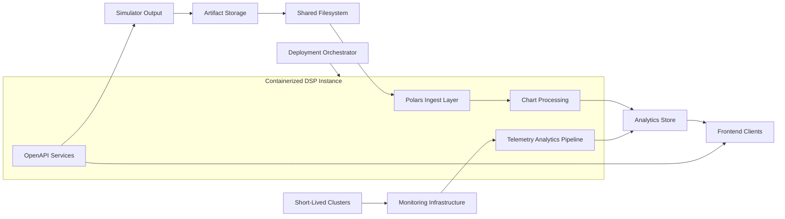

# Scale-Up DSP Plan

# Executive Summary

Evolve the Digital Signal Processing (DSP) analytics stack to a unified data pipeline that generates existing charts with Polars, runs in a containerized deployment model, and introduces a telemetry-driven analytics path backed by new infrastructure and OpenAPI contracts. This unification simplifies maintenance, improves performance, and prepares the platform for upcoming telemetry-based insights.

### Critical Constraint

**Deterministic analytics for existing dashboards must be preserved.** Migrating to Polars cannot alter current chart outputs or latency SLOs; regression tests must validate parity before decommissioning legacy code.

### Approach

- Standardize all chart generation on a single Polars-based library for ingest, transformation, and visualization data prep.
- Containerize the DSP runtime to deliver predictable deployments across environments (dev/stage/prod).
- Extend infrastructure with telemetry pipelines that stream simulator data—supporting realtime and five-minute delayed feeds—to the DSP and expose results via OpenAPI-defined endpoints for simulator and frontend consumers.
- Implement governance and regression validation to ensure existing analytics remain accurate during the migration.
- Incrementally roll out telemetry-based analytics, starting with new metrics and expanding coverage over time.

## Problem Statement

**Current State:** The DSP relies on multiple data-processing scripts and libraries to produce charts, making maintenance complex and introducing inconsistent performance characteristics. Deployments depend on bespoke AMI and python virtual environments setups that are difficult to reproduce.

**Limitations:**

- Disparate chart-generation code paths complicate enhancements and bug fixes.
- VM-based deployments lack reproducibility, slow down rollouts, and increase operational toil.
- There is no standardized telemetry ingestion pipeline, limiting real-time analytics potential.
- Simulator and frontend teams lack a clear API contract for accessing new telemetry insights.

**Goal:** Deliver a consolidated, containerized DSP that uses Polars for existing charts, supports telemetry-driven analytics via new infrastructure and APIs, and maintains compatibility with current dashboards.

## Architecture

### High-Level Design

### Component Breakdown

#### Deployment Orchestrator

- Launches the containerized DSP on the new instance when workloads arrive.
- Mounts the shared filesystem containing simulator artifacts before handing off execution.
- Manages container lifecycle without owning the new monitoring infrastructure.

#### Polars Ingest & Transformation

- Unified data-loading layer converting simulator artifacts from the shared filesystem into Polars DataFrames.
- Provides reusable transformation functions for chart datasets, ensuring consistent schema handling.
- Includes regression tests comparing Polars outputs against legacy results for key dashboards.

#### Chart Processing

- Generates existing charts from within the orchestrator-launched container by using the Polars transformation outputs and exporting datasets to visualization tooling.
- Supports batch mode for post-run processing and on-demand mode for replays.
- Emits lineage metadata to trace input artifacts to generated charts.

#### Telemetry Analytics Pipeline

- Consumes telemetry delivered by the new monitoring infrastructure, which aggregates signals from short-lived clusters outside the orchestrator's control.
- Applies Polars-based aggregation windows to compute near-real-time metrics alongside stabilized five-minute delayed rollups.
- Persists telemetry summaries in the analytics store for querying and dashboard overlays.

#### OpenAPI Services

- Defines versioned OpenAPI specifications covering:
  - Simulator-facing endpoints for uploading artifacts and telemetry handshakes.
  - Frontend-facing endpoints for retrieving chart datasets and telemetry insights.
- Generates server/client stubs to enforce contract adherence and simplify integration.

#### Containerized Deployment

- Container images encapsulate Polars dependencies, DSP code, and runtime configuration.
- Deployment pipeline publishes versioned images to the registry and orchestrates rollouts across environments.
- Includes health checks, autoscaling policies, and logging/metrics exporters.

## Current Analytics Flow

Current DSP processing follows ad hoc scripts that directly read simulator artifacts, use mixed libraries (Pandas, custom parsing), and output chart data to storage:

1. Simulation artifacts are deposited into object storage.
2. DSP scripts pull artifacts, execute per-chart transformations, and write results.
3. Frontend retrieves chart data from storage or through bespoke APIs.

**Challenges:**

- Per-chart scripts diverge over time, causing inconsistent chart definitions.
- Performance tuning must be repeated for each library.
- Deployment environments drift due to manual configuration, leading to difficult troubleshooting.

## Proposed DSP Implementation

### Polars Migration

- Replace legacy parsing/transformation scripts with a Polars-based library that encapsulates data loading, cleansing, and aggregation.
- Provide compatibility adapters to ensure existing chart IDs and schema remain unchanged.
- Build a regression suite that compares historical runs processed by legacy vs. Polars pipelines to guarantee parity.

### Container Deployment Model

- Package the DSP into a container image with pinned dependencies (Polars, runtime libraries).
- Use infrastructure-as-code to provision container runtime environments (e.g., ECS, EKS, or serverless containers) that the deployment orchestrator can target.
- Integrate orchestrator workflows to launch containers on new DSP instances and attach the shared filesystem before execution.
- Implement CI/CD pipelines that build, test, and promote images through dev/stage/prod.

### Telemetry Analytics Expansion

- Integrate the new monitoring infrastructure to collect telemetry from short-lived clusters and forward it to the DSP pipeline without orchestrator coordination.
- Introduce telemetry ingestion endpoints that authenticate upstream monitoring feeds and buffer events.
- Store raw telemetry in a durable queue or stream, then fan out to Polars-driven processing jobs tuned for realtime and five-minute delayed windows.
- Produce incremental aggregates and five-minute lagging batches, persisting both to the analytics store to enable quick refreshes and parity checkpoints for dashboards.

### OpenAPI Contracts

- Author OpenAPI documents that describe DSP ingestion and retrieval endpoints.
- Use schema definitions to validate payloads at runtime and generate SDKs for simulator/frontend teams.
- Embed versioning and deprecation policies to evolve APIs without breaking consumers.

## Example Processing Sequence

1. Simulator completes a run, pushing artifacts to object storage that syncs to the shared filesystem.
2. The deployment orchestrator spins up the containerized DSP instance, mounting the shared filesystem for processing.
3. The DSP container runs Polars transformations on the filesystem artifacts and writes chart datasets into the analytics store.
4. Monitoring infrastructure ingests telemetry from short-lived clusters and streams it to the telemetry pipeline for immediate insights and five-minute delayed validations.
5. DSP exposes chart and telemetry endpoints defined by OpenAPI; frontend consumes datasets for dashboards.
6. Regression and monitoring tools verify that outputs meet latency and accuracy SLOs.

## Design Decisions

### 1. Polars as the Single Analytics Library

Polars offers high performance, consistent APIs, and a single dependency surface, streamlining maintenance and reducing the likelihood of divergent implementations.

### 2. Containerized Deployment

Containerization guarantees environment consistency, simplifies scaling, and integrates with existing DevOps tooling for automated rollouts and observability.

### 3. Telemetry-First Analytics Expansion

Building telemetry pipelines now enables future real-time features while leveraging the Polars foundation for consistency between batch and streaming analytics.

### 4. OpenAPI Governance

OpenAPI specifications formalize communication between the simulator, DSP, and frontend, reducing integration friction and ensuring contract clarity.

## References

- Scale-Up Simulation PRD
- Polars Documentation
- Container platform deployment guides
- OpenAPI Specification (OAS) documentation
