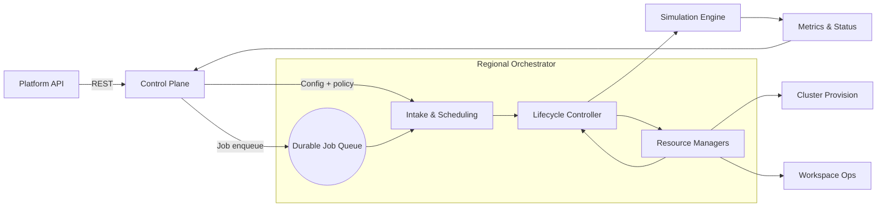

# Scale-Up Orchestrator Plan

# Executive Summary

Build a dedicated orchestrator service, separate from the customer-facing API, to manage the full lifecycle of simulations and all associated infrastructure (clusters, workspaces, storage). 
Each orchestrator instance runs within a region (us-east-1 as the default region), reads configuration supplied by the centralized control plane, and coordinates with that plane exclusively through REST APIs. 
This architecture preserves the existing API footprints while enabling regional autonomy, predictable SLOs, and future multi-region growth.
It will use ODCR (on-demand capacity reservations) as the main methodology of managing AWS EC2 resources.

### Critical Constraint

**Simulation launch SLOs are hard commitments.** The orchestrator may not exceed the 15-minute total orchestration budget or the P95 ≤ 5 minute launch target for 144-CPU runs. When downstream resources, such as EC2 capacity, return errors, the orchestrator retries with exponential backoff and relies on its basic queue to surface backpressure rather than letting jobs stall silently.

### Approach

- Establish a clear boundary between the Platform API and the orchestrator through versioned REST contracts published by the control plane.
- Persist configuration in a control-plane-backed store so orchestrators can reload mutable policy (quotas, SKUs, cluster templates) without redeploying.
- Capture and persist the detailed hardware configuration provisioned for each simulation.
- Rely on durable job queues and reconciliation loops to enforce concurrency limits and meet SLOs even during burst traffic.
- Prepare for multi-region scale by keeping the control plane stateless and aggregating orchestrator metrics and run data centrally.

## Problem Statement

**Current State:** The platform API currently handles both customer requests and simulation lifecycle logic. Resource provisioning (clusters, workspaces) is tightly coupled to API handlers, producing long critical paths and limited observability.

**Limitations:**

- Inconsistent separation of concerns makes it difficult to evolve orchestration logic independently.
- Scaling API containers to absorb user traffic also scales orchestration logic, which is inefficient during regional bursts.
- Lack of durable queues or reconciliation loops creates risk of missed SLOs when downstream systems throttle.
- Configuration changes (e.g., cluster templates) require code or deployment changes.

**Goal:** Deliver a service-oriented orchestrator that manages simulations and supporting resources end-to-end, decoupled from the API, with strong observability, well-defined REST interfaces, and the ability to run one orchestrator per region backed by a centralized control plane.

## Architecture

### High-Level Design

### Component Breakdown

#### Control Plane REST API

- Hosts versioned REST endpoints for job submission (`/v1/simulations`), status retrieval, and configuration delivery.
- Maintains the authoritative configuration store (region quotas, cluster templates, workspace policies).
- Aggregates metrics and orchestrator heartbeats for centralized observability.

#### Regional Orchestrator Service

- Stateless service running in each region with access to the control-plane REST APIs.
- Subcomponents:
  - **Job Intake Service:** Polls or receives notifications from the regional job queue, validates payloads, and enforces admission control before handing off to lifecycle management.
  - **Lifecycle Controller:** Implements reconciliation loops that create, monitor, and tear down simulation runs plus dependent resources (clusters, workspaces, storage).
  - **Resource Managers:** Agents that manage EC2 capacity reservations, configure container fleets, and handle workspace lifecycle (filesystem mounts, credentials).
  - **Configuration Agent:** Fetches configuration snapshots from the control plane at startup.

#### Durable Job Queue

- Ensures job requests survive orchestrator restarts and can be retried safely.
- Supports per-tenant concurrency controls and priority ordering.
- Emits queue depth and age metrics for SLO alerting.

#### Observability Stack

- Exposes metrics (latency, queue time, reconciliation retries), structured logs, and traces to the control plane.
- Dashboards highlight P95 launch latency, error rates, resource provisioning times, and per-tenant concurrency usage.

### API Boundary

- REST contract between API/control plane and orchestrator encapsulates CRUD on simulations plus configuration snapshot endpoints.
- Orchestrator returns status transitions (`SUBMITTED`, `STARTING`, `RUNNING`, `COMPLETED`, `FAILED`) and resource metadata (cluster IDs, workspace IDs) through callbacks or polling endpoints.
- Auth utilizes region-scoped service principals managed by the control plane.

## Current Operational Flow

Today, the API receives simulation requests, validates them, and directly provisions resources:

1. API handler authenticates user and writes the run record.
2. Handler provisions clusters, workspaces, and storage inline with request processing.
3. Simulation containers launch once infrastructure is ready.
4. Status updates are pushed from the same API service to clients.

**Challenges:**

- Resource provisioning shares compute with API request handling, reducing availability during spikes.
- Failures midway through orchestration lack automated retries or compensation logic.
- Configuration updates require rollouts because logic and config are co-located.

## Proposed Orchestrator Implementation

### Separation of API and Orchestrator

- API remains focused on request validation, tenant policy enforcement, and user-facing status reads.
- Once a run is accepted, the API writes to the durable queue via the control plane and immediately returns.
- The orchestrator consumes from the queue, taking full ownership of resource creation, monitoring, and teardown.

### Lifecycle Management

- **Pending → Preparing:** Orchestrator validates prerequisites, reserves capacity, and records intent in the control plane.
- **Preparing → Launching:** Compute manager provisions or reuses EC2 capacity for the containerized simulation, while the workspace manager prepares per-run environments.
- **Launching → Running:** Simulation engine containers start, orchestrator emits telemetry and updates control plane status.
- **Running → Complete:** Upon success/failure, orchestrator deallocates resources, archives artifacts, and posts final state.

### Resource Provisioning and Configuration

- Configuration agent loads templates for clusters (Instance type, node count) and workspace policies (storage paths, secrets).
- Resource managers apply templates via infrastructure providers (cloud SDKs) with retries and backoff.
- Control plane can push configuration changes via REST.

### Multi-Region Deployment

- Each region runs an identical orchestrator stack pointed at region-specific queues and infrastructure endpoints.
- Control plane assigns runs to regions based on capacity and policy, maintaining global quotas.
- Metrics and audit logs roll up to central dashboards, enabling fleet-wide visibility.

## Example Run Sequence

1. Customer submits a simulation via the API; API validates and records the request.
2. API forwards the job payload to the control plane, which enqueues it for the target region.
3. Regional orchestrator intake worker dequeues the job, loads applicable configuration, and transitions status to `preparing-resources`.
4. Compute manager provisions or scales the required EC2 capacity for containers; workspace manager sets up workspace/storage.
5. Once resources report ready, lifecycle controller launches the simulation engine and marks status `running`.
6. Orchestrator streams metrics and state transitions to the control plane; API surfaces them to clients.
7. On completion, orchestrator tears down auxiliary resources, updates status (`succeeded`/`failed`), and archives logs.

## Design Decisions

### 1. Dedicated Orchestrator Service

Separating orchestration from the API isolates heavy lifecycle logic, allows independent scaling, and creates a service boundary for ongoing feature work (e.g., new resource types, retry policies).

### 2. REST Communication with Control Plane

REST endpoints (with region-scoped auth) standardize how orchestrators receive jobs, fetch configuration, and publish status, enabling language-agnostic clients and straightforward governance.

### 3. Configuration as Data

Treat configuration (cluster SKUs, workspace policies, quotas) as data managed by the control plane. Orchestrators load it dynamically, making it simple to roll out tweaks without deployments.

### 4. Backpressure and SLO Enforcement

Durable queues plus concurrency controls let orchestrators shed load gracefully (returning 429s via API) when regional capacity is exhausted, ensuring SLO visibility instead of silent degradation.

### 5. Regional Autonomy with Central Observability

Running one orchestrator per region provides low-latency control over local resources while keeping the control plane authoritative for audit, metrics, and configuration.

## References

- Scale-Up Simulation PRD
- AWS On-Demand Capacity Reservations documentation
- Cloud provider autoscaling guides for EC2 workloads
- Internal runbooks and dashboards for the simulation platform
